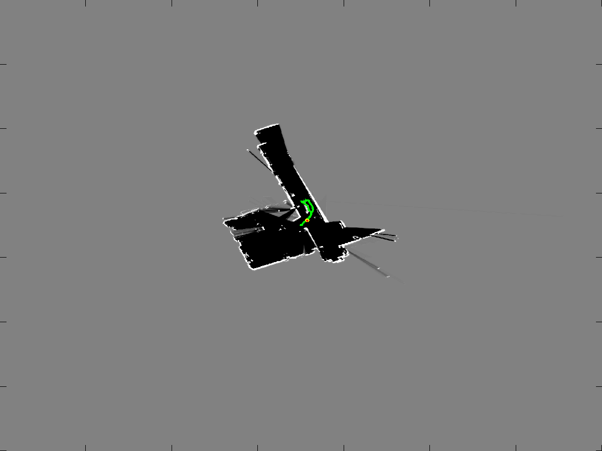

# Simultaneous Localization and Mapping (SLAM) using particle filters

This project aims to simultaneously localize a walking humanoid robot and map an unknown indoor environment using odometry data, IMU orientation and a 2D laser range scanner (LIDAR). A particle filter based approach is taken to achieve the objective. Particle filters effectively model a probability distribution as a set of discrete states. Each particle has an associated weight which describes its confidence in its current estimate of pose according to the observation.

This project was done as a part of ESE650 Learning in Robotics, University of Pennsylvania in the spring of 2015.

More information can be found in the [report](./report/project4.pdf)

#### THOR robot

## Results

## References

Dr. Daniel Lee's ESE 650 lecture notes